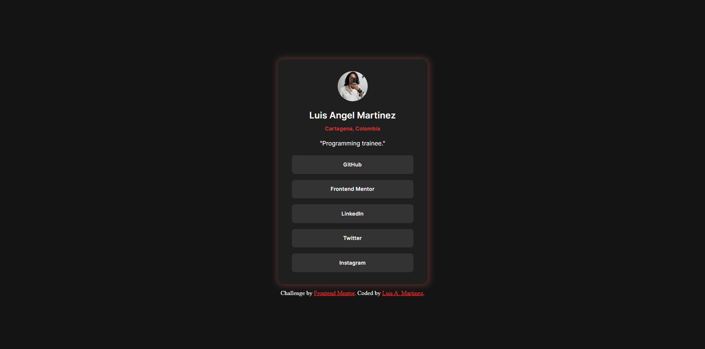
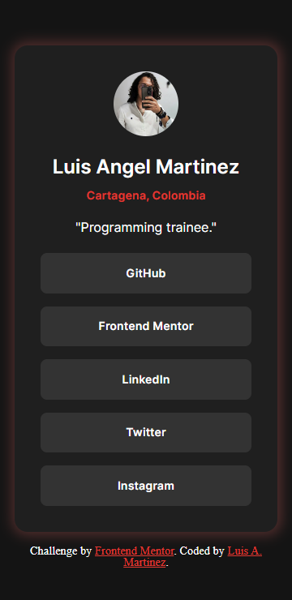
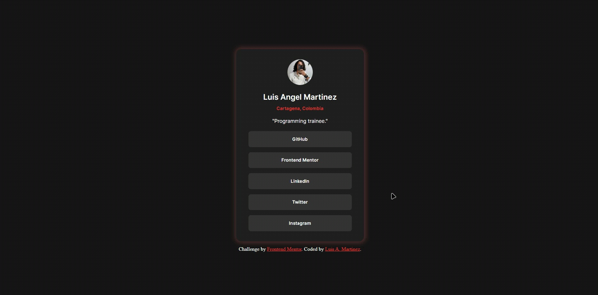

# Frontend Mentor - Social links profile solution

This is a solution to the [Social links profile challenge on Frontend Mentor](https://www.frontendmentor.io/challenges/social-links-profile-UG32l9m6dQ). Frontend Mentor challenges help you improve your coding skills by building realistic projects 

## Table of contents

- [Overview](#overview)
  - [The challenge](#the-challenge) 
  - [Screenshot](#screenshot)
  - [Links](#links)
- [My process](#my-process)
  - [Built with](#built-with)
  - [Continued development](#continued-development)
- [Author](#author)

## Overview

### The challenge

Users should be able to:

- See hover and focus states for all interactive elements on the page

### Screenshot Desktop Design

### Screenshot Mobile Design

### Screenshot Active States

### Links

- Solution URL: [Github Solution](https://github.com/LuisAngel96/social-links-profile)
- Live Site URL: [Live site](https://luisangel96.github.io/social-links-profile/)

## My process

### Built with

- Semantic HTML5 markup
- CSS custom properties
- Flex
- Media queries

### Continued development

I'm learning everything about frontend and practicing...

## Author

- GitHub - [Luis A. Martinez](https://github.com/LuisAngel96)
- Frontend Mentor - [@LuisAngel96](https://www.frontendmentor.io/profile/LuisAngel96)

